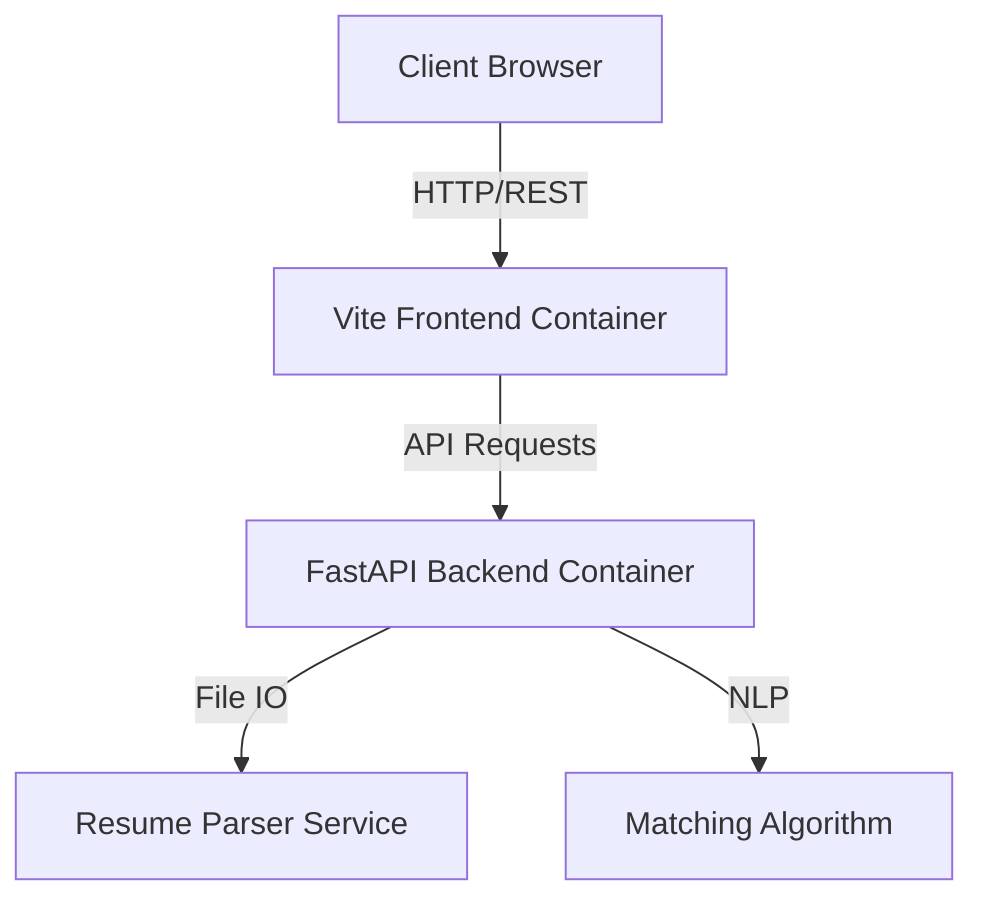

# ATS Resume Scanner & Analyzer 🚀

[](https://github.com/AbdullrahmanEissa/ATS-Resume-Backend-Frontend-Fully-Automated-Deployment)
[](https://fastapi.tiangolo.com/)
[](https://vitejs.dev/)
[](https://www.docker.com/)
[](./LICENSE)

A powerful, full-stack **Applicant Tracking System (ATS) Scanner** that automates the process of parsing resumes and matching them against job descriptions. This project demonstrates a complete **DevOps lifecycle**, featuring a modern React/Vite frontend, a robust Python/FastAPI backend, containerized microservices, and fully automated deployment using Ansible.

---

## 📸 Demo & Screenshots

> *Insert a GIF or video walkthrough of the application here showing the upload process and result analysis.*

### Dashboard View

*Real-time analysis showing resume score, matched keywords, and extracted preview.*

---

## ✨ Key Features

* **📄 Intelligent Resume Parsing:** Automatically extracts text, skills, and metadata from `.docx` and `.pdf` files.
* **🎯 Contextual Scoring:** Compares resume content against specific job descriptions to calculate a match percentage.
* **⚡ Modern Frontend:** Fast, responsive SPA built with **Vite** and **React/Vue**.
* **🔧 Robust Backend API:** Built with **Python FastAPI** and **Pydantic** for high performance and strict data validation.
* **🐳 Fully Containerized:** Dockerized services for the frontend and backend with optimized multi-stage builds.
* **🤖 Automated Deployment:** Complete **Ansible** playbooks to provision servers, install dependencies, and deploy the application (Infrastructure as Code).

---

## 🏗️ Architecture

The application follows a microservices architecture wrapped in Docker containers, orchestrated for local development and deployed via Ansible for production.



### Tech Stack

* **Frontend:** React (Vite), JavaScript/TypeScript, CSS Modules.
* **Backend:** Python 3.12, FastAPI, Pydantic, Uvicorn.
* **DevOps:** Docker, Docker Compose, Ansible, Git.
* **Server:** Nginx (Reverse Proxy), Ubuntu/Linux.

---

## 📂 Project Structure

```bash
ATS-Resume-Scanner/
├── ansible/                # Ansible playbooks for automated deployment
│   ├── inventory/          # Server inventory configuration
│   └── playbooks/          # Deployment tasks (deploy.yml)
├── frontend/               # Vite SPA Source Code
│   ├── src/
│   ├── public/
│   └── Dockerfile          # Frontend container definition
├── models/                 # Pydantic data models (schemas.py)
├── routers/                # API endpoints
├── services/               # Business logic (parser, scorer, uploads)
├── main.py                 # Application entry point
├── requirements.txt        # Python dependencies
└── Dockerfile              # Backend container definition

```

---

## 🚀 Quick Start (Local Development)

### Prerequisites

* Docker & Docker Compose installed.
* Git installed.

### Option 1: Running with Docker (Recommended)

1. **Clone the repository**
```bash
git clone [https://github.com/AbdullrahmanEissa/ATS-Resume-Backend-Frontend-Fully-Automated-Deployment.git](https://github.com/AbdullrahmanEissa/ATS-Resume-Backend-Frontend-Fully-Automated-Deployment.git)
cd ATS-Resume-Backend-Frontend-Fully-Automated-Deployment

```


2. **Build and Run the Containers**
You can build the images manually as shown in the project logs:
```bash
# Create a shared network
docker network create ats-net

# Build and Run Backend
docker build -t ats-backend .
docker run --name backend --network ats-net -d -p 8000:8000 ats-backend:latest

# Build and Run Frontend
cd frontend
docker build -t ats-frontend .
docker run --name frontend --network ats-net -d -p 5173:5173 ats-frontend:latest

```


3. **Access the App**
* Frontend: `http://localhost:5173`
* Backend API Docs: `http://localhost:8000/docs`


---

## ⚙️ Production Deployment (Ansible)

This project uses **Ansible** to fully automate the deployment process on a Linux server.

1. **Configure Inventory:**
Update `ansible/inventory/hosts.ini` with your target server IP and user details.
2. **Run the Playbook:**
The `deploy.yml` playbook handles updating `apt`, setting up Python/Node environments, and deploying the code.
```bash
cd ansible
ansible-playbook -i inventory/hosts.ini playbooks/deploy.yml

```


*What this playbook does:*
* ✅ Updates system packages.
* ✅ Installs Node.js 20.x, Python 3, pip, and venv.
* ✅ Sets up the backend virtual environment and installs dependencies.
* ✅ Builds the Vite frontend for production.


---

## 👨‍💻 Skills Demonstrated

This project serves as a portfolio piece demonstrating proficiency in:

* **Full-Stack Development:** Connecting a reactive frontend with a logic-heavy backend.
* **DevOps & Automation:** Moving beyond "it works on my machine" to reliable Ansible deployments.
* **Containerization:** optimizing Dockerfiles for separate build and runtime environments.
* **System Design:** Structuring a clean MVC-patterned backend with `routers`, `services`, and `models`.

---

## 📝 License

Distributed under the MIT License. See `LICENSE` for more information.

---

**Author:** [Abdullrahman Eissa](https://www.google.com/search?q=https://github.com/AbdullrahmanEissa)

```

```
